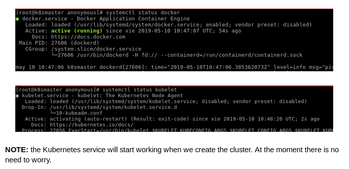

# Kubernetes installation (Cent0S)

## Steps

 * Copy the contents of the **installation_kubeadm_centos.sh** script and run it

 ```diff
$ cd /tmp  # or if you want to save the script copy it into another location
$ sudo touch preinstall.sh
$ sudo vim preinstall.sh # Copy the script inside this file.
```
> **Note**: It will take a couple of minutes

## Once installed, we check that the services are working:




```diff
- IMPORTANT
```


